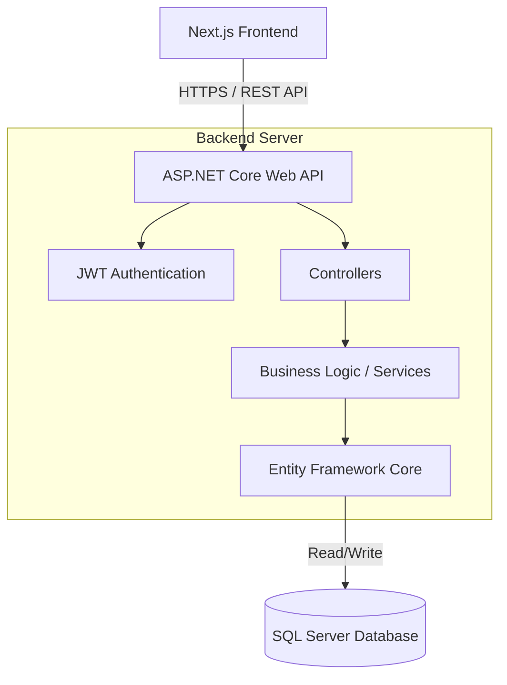

# Student Management System

## 1️⃣ Project Overview
A comprehensive, large-scale Student Management System designed to centralize and streamline academic administration. It solves the fragmentation of academic data by unifying student enrollments, faculty assignments, attendance tracking, project allocations, and result management into a single, cohesive platform.

## 2️⃣ Features
- **User & Role Management**: Secure authentication and role-based access for Students, Faculty, and Administrators.
- **Notification**: Sends notifications to students and faculty regarding important updates and information.
- **Academic Hierarchy**: Manage Departments, Programs, Academic Years, Semesters, and Subjects.
- **Enrollment & Results**: Track student semester enrollments, grading, and compute overall semester and subject-specific results and generate marksheets.
- **Attendance Tracking**: Record and monitor class sessions and student attendance records.
- **Import/Export**: Import and export data from and to Excel/PDF files to generate marksheet and attendance record per student or semester or for entire class.
- **Project Management**: Allocate projects to students, assign faculty supervisors, and track individual project tasks and overall performance of students.
- **Resource Sharing**: Distribute and manage study materials and resources per subject,semester,program.

## 3️⃣ Tech Stack
- **Frontend**: Next.js 16.3 (App Router), React 19 - *Chosen for SSR performance, optimal SEO, and a modern component-based architecture.*
- **Styling**: Tailwind CSS v4 - *Utility-first CSS framework for rapid, responsive UI development.*
- **Backend**: .NET 10 Web API - *Provides a highly performant, scalable, and strongly-typed RESTful API.*
- **ORM & Database**: Entity Framework Core 10 & SQL Server - *Handles complex relational data modeling, schema migrations, and robust data integrity.*
- **Security**: BCrypt for password hashing and JWT (JSON Web Tokens) for secure, stateless authentication.

## 4️⃣ Architecture 🔥

*The architecture follows a standard client-server model where the Next.js frontend communicates with a scalable .NET 10 Web API, which manages business logic and interfaces with SQL Server via EF Core.*

## 5️⃣ Project Structure
- `/frontend` - Contains the Next.js 16 user interface.
  - `/app` - Next.js App Router pages and layouts.
  - `/public` - Static assets like images and icons.
- `/StudentManagmentSystem` - The .NET 10 backend application.
  - `/Controllers` - API endpoints handling HTTP requests.
  - `/Models` - Domain entities (Student, Faculty, Attendance, etc.).
  - `/Data` - EF Core DbContext and database configurations.
  - `/Migrations` - EF Core database migration scripts.
- `schema.md` & `code.md` - Core domain design, database schema, and initial entity relationship documentation.

## 6️⃣ Installation & Setup
### Prerequisites
- Node.js (v20+)
- .NET 10 SDK
- SQL Server (LocalDB or dedicated instance)

### Backend Setup (.NET 10)
1. Navigate to the backend directory:
   ```bash
   cd StudentManagmentSystem
   ```
2. Restore dependencies:
   ```bash
   dotnet restore
   ```
3. Update the connection string in `appsettings.json` to point to your SQL Server instance.
4. Apply database migrations:
   ```bash
   dotnet ef database update
   ```
5. Run the server:
   ```bash
   dotnet run
   ```
   *(The API will typically be available at `http://localhost:5000` or `https://localhost:5001`)*

### Frontend Setup (Next.js)
1. Navigate to the frontend directory:
   ```bash
   cd frontend
   ```
2. Install dependencies:
   ```bash
   npm install
   ```
3. Configure environment variables (create a `.env.local` file and add the backend API URL):
   ```env
   NEXT_PUBLIC_API_URL=http://localhost:5000/api
   ```
4. Start the development server:
   ```bash
   npm run dev
   ```
   *(The frontend will be available at `http://localhost:3000`)*

## 7️⃣ Usage
1. **Login**: Access the web portal and log in using your assigned credentials (Admin, Faculty, or Student).
2. **Dashboard**: Upon login, you are redirected to a role-specific dashboard.
3. **Administration (Admin)**: Manage departments, create programs, and register new users.
4. **Academics (Faculty)**: View assigned subjects, mark daily attendance for class sessions, and upload study materials.
5. **Student Portal**: View enrolled subjects, check attendance status, download materials, and track project tasks.

## 8️⃣ Screenshots / Demo
*(Currently in active development. Screenshots and demo links will be added once the initial UI is finalized.)*

## 9️⃣ API Documentation
The backend API is documented using **OpenAPI/Scalar** (configured in the .NET 10 project). 
Once the backend is running, you can explore the endpoints, required parameters, and expected responses by navigating to the API docs endpoint. Authentication for secured endpoints requires a Bearer JWT token passed in the `Authorization` header: `Authorization: Bearer <your_token>`.

## 🔟 Engineering Decisions
- **.NET 10 & EF Core**: Chosen for strong typing, exceptional performance, and robust LINQ querying capabilities, which are crucial for handling complex academic relationships.
- **Next.js App Router**: Adopted to leverage Server Components (RSC) for improved load times and SEO, while keeping client-side interactivity where needed.
- **Database Normalization**: The schema separates core users (`User`) from specific roles (`Student`, `Faculty`) to allow flexible access control while avoiding sparse tables.
- **JWT Authentication**: Implemented to ensure stateless, scalable, and secure communication between the frontend and backend without relying on server-side sessions.

## 1️⃣1️⃣ Testing
*(Testing suite is currently being established)*
- **Backend Tests**: xUnit will be used for unit testing services and controllers. Run via `dotnet test`.
- **Frontend Tests**: Jest and React Testing Library will be used for component testing. Run via `npm run test`.

## 1️⃣2️⃣ Limitations & Future Improvements
**Current Limitations:**
- Lack of an automated email/notification system for attendance alerts or grade publications.
- The UI is still under construction and lacks full mobile responsiveness.

**Future Improvements:**
- Integration with a cloud storage provider (e.g., AWS S3 or Azure Blob) for handling large material uploads.
- Adding a comprehensive analytics dashboard for admins to visualize overall student performance and attendance trends.
- Implementing automated database backups and caching (Redis) for frequently accessed data like department lists.